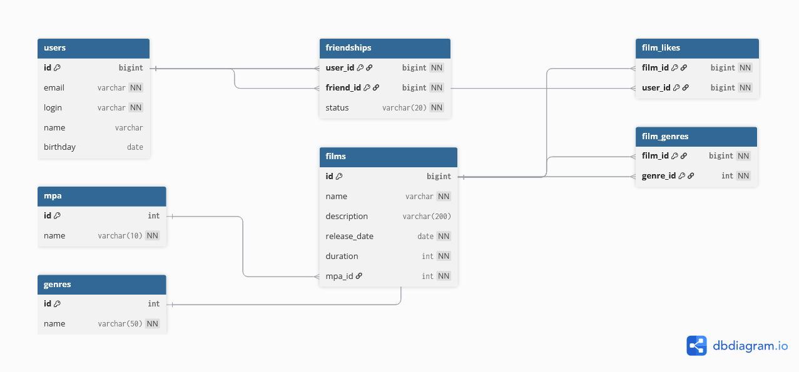

# java-filmorate

# Filmorate Database Schema

## ER-диаграмма



---

## Описание схемы базы данных

База данных Filmorate спроектирована в соответствии с принципами нормализации (1NF, 2NF, 3NF).  
Все связи реализованы через внешние ключи.  
Массивы и вложенные структуры в колонках не используются.

### Основные сущности:

### users
Хранит информацию о пользователях:
- id — первичный ключ
- email
- login
- name
- birthday

---

### films
Хранит информацию о фильмах:
- id — первичный ключ
- name
- description
- release_date
- duration
- mpa_id — внешний ключ на таблицу mpa

---

### mpa
Справочник возрастных рейтингов:
- G
- PG
- PG-13
- R
- NC-17

---

### genres
Справочник жанров фильмов.

---

### film_genres
Таблица связи многие-ко-многим между фильмами и жанрами.  
Первичный ключ составной: (film_id, genre_id).

---

### film_likes
Хранит лайки пользователей фильмам.  
Первичный ключ составной: (film_id, user_id).  
Обеспечивает невозможность поставить лайк одному фильму дважды.

---

### friendships
Таблица связей пользователей.  
Содержит статус дружбы:
- UNCONFIRMED — запрос отправлен
- CONFIRMED — дружба подтверждена

Первичный ключ составной: (user_id, friend_id).

---

## Примеры SQL-запросов

### Получить список всех фильмов

```sql
SELECT * FROM films;

### Получить топ-10 популярных фильмов

```sql
SELECT f.id,
       f.name,
       COUNT(fl.user_id) AS likes_count
FROM films f
LEFT JOIN film_likes fl ON f.id = fl.film_id
GROUP BY f.id
ORDER BY likes_count DESC
LIMIT 10;

### Получить жанры конкретного фильма

```sql
SELECT g.name
FROM film_genres fg
JOIN genres g ON fg.genre_id = g.id
WHERE fg.film_id = 1;

### Получить общих друзей двух пользователей

```sql
SELECT u.*
FROM friendships f1
JOIN friendships f2
    ON f1.friend_id = f2.friend_id
JOIN users u
    ON u.id = f1.friend_id
WHERE f1.user_id = 1
  AND f2.user_id = 2
  AND f1.status = 'CONFIRMED'
  AND f2.status = 'CONFIRMED';

### Получить MPA рейтинг фильма

```sql
SELECT m.name
FROM films f
JOIN mpa m ON f.mpa_id = m.id
WHERE f.id = 1;
